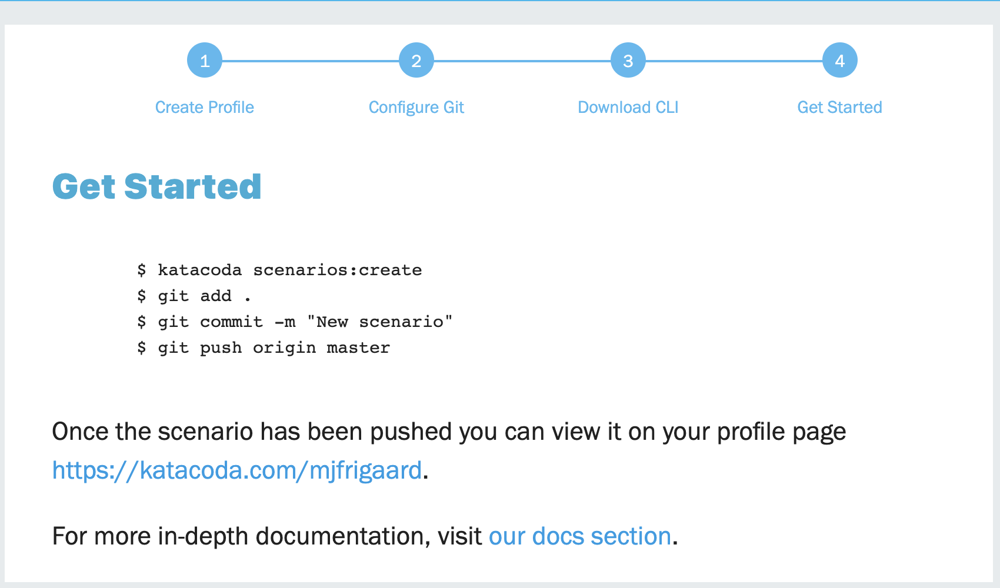

Basic command line tools (Katacoda)
========================

This is the first scenario for Katacoda (from O'Reilly).

## Download CLI for Katacoda

First download the installation pack from Terminal:

```bash
npm install katacoda-cli --global
```

## Setup scenario with Katacoda

After receiving the Katacoda Invite email, I logged into Katacoda with my Github account.



The url for my acount is created (`https//:katacoda.com/mjfrigaard`).

The link for the documentation is [here](https://www.katacoda.com/docs). These steps were uses to set up the scenario for Katacoda.

```bash
% katacoda scenarios:create
? Friendly url:  basic-command-line-tools # <- this will be the local folder
? Scenario Title:  "Introduction to the command line"
? Scenario Description:  "This is a lesson on some basic command line skills for processing and managing data."
? Difficulty Level:  Beginner
? Estimated time: (Please specify in minutes or hours e.g. 2 hours) 45
? Number of Steps (Not including intro & finish):  12
? Image:  Bash # this only uses the command line
? Layout:  Editor + Terminal # not sure what we'll find here, but we will find out!
```

## Setting up the Github repo

These commands were used to set up the Gitub repo.

```bash
git remote add origin https://github.com/mjfrigaard/basic-command-line-tools.git
git push -u origin master
```

## Katacoda tutorial

The tutorial for building the scenario is [here](https://katacoda.com/scenario-examples/scenarios/create-scenario-101).

### Katacoda guidelines

There are multiple guidelines and resources for writing scenarios. O'Reilly has provided an Authoring Guide and Formatting and Design Guide.

The link for these files can be found here:


## Scenario contents

This scenario covers some basic features of the command line, specifically [Z shell (Zsh)](https://en.wikipedia.org/wiki/Z_shell). In 2018, the macOS switched from the Bash
